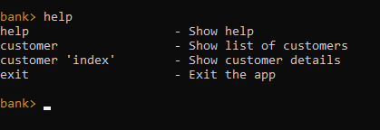

# Lab 2
# Створення CLI у стилі REPL з допомогою jline 3
Мета роботи - навчитись створювати прості текстові інтерфейси з допомогою популярної бібліотеки [jline 3](https://github.com/jline/jline3).

## На "трійку"

## Результат:

## На "чотири"

## Результат:

## На "п'ять"

## Результат:

